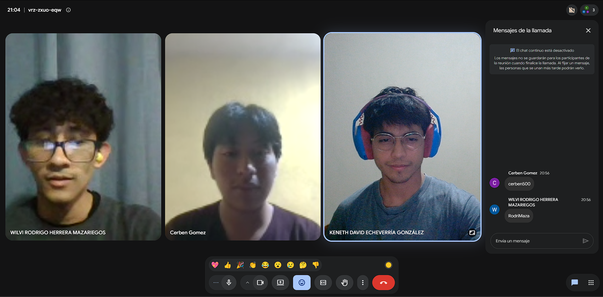

# Actividad práctica 5 - Laboratorio de Comunicación Asertiva

## Integrantes

- Keneth David Echeverria González - 202501380
- Cristian David Yumán Gómez - 202502231
- Wilvi Rodrigo Herrera Mazariegos - 202504208

---

# 1. Escenario

## 1.1 Situación

Tienes varias entregas importantes programadas para el mismo día y sabes que no podrás cumplir con una de ellas a tiempo. Debido a esta situación, necesitas comunicarte con el docente o con tu equipo para solicitar una extensión en la fecha de entrega.

## 1.2 Reto

Negociar una nueva fecha de entrega explicando la situación de manera clara, responsable y profesional, evitando que la solicitud parezca una excusa o falta de compromiso.

## 1.3 Objetivo

Practicar la negociación asertiva, manteniendo la credibilidad y demostrando compromiso con el cumplimiento de la actividad.

---

# 2. Análisis del escenario

## 2.1 Problema comunicativo

El problema comunicativo consiste en informar que no será posible cumplir con la fecha establecida y solicitar una extensión sin generar una impresión de irresponsabilidad. La comunicación debe realizarse con anticipación, de forma clara y respetuosa, explicando la situación y proponiendo una alternativa concreta.

## 2.2 Personas involucradas

- **Estudiante:** debe comunicar la dificultad, asumir responsabilidad y proponer una nueva fecha de entrega.
- **Docente o integrante responsable del equipo:** debe escuchar la solicitud, evaluar la situación y decidir si es posible aceptar o negociar una nueva fecha.

## 2.3 Necesidades identificadas

El estudiante necesita disponer de más tiempo para completar la entrega de manera adecuada. Al mismo tiempo, el docente o el equipo necesita mantener una planificación clara y asegurarse de que la nueva fecha acordada sea respetada.

## 2.4 Límites o dificultades identificadas

La principal dificultad es que existe una fecha de entrega previamente establecida y varias responsabilidades coinciden el mismo día. También existe el riesgo de que la solicitud sea interpretada como falta de organización o compromiso. Por ello, es necesario comunicar la situación con responsabilidad, proponer una fecha realista y comprometerse a cumplir con el nuevo acuerdo.

---

# 3. Aplicación de comunicación asertiva

## 3.1 Estrategia utilizada

La estrategia consistirá en negar una nueva fecha de entrega de manera profesión después del lapso establecido, para esto se deberá de argumentar de por que esto no es posible ampliar la fecha de entrega de manera directa y clara.

## 3.2 Escucha activa

Durante la reunión, se deberán de escuchar activamente y entender la situación de ambas partes, sin interrumpir a cada uno y escuchando sus argumentos.

## 3.3 Manejo de límites

En los límites se analizará al comunicar de manera clara que no se puede asumir el cumplimiento de la entrega en la fecha actual. Esto se realiza con el objetivo de cumplir con el tiempo y las responsabilidades, evitando la sobrecarga de trabajo. 

## 3.4 Negociación

La negociación se para llegar a un acuerdo sobre una nueva fecha para la entrega. Se buscará ya sea una penalización o un nuevo requisito para la entrega, esto para que llegar a un acuerdo justo para el docente.

## 3.5 Técnica de retroalimentación

Se utilizará la técnica de situacional, primero se analizar la situación y comprender su solicitud, se observa como es el comportamiento al momento de negocia, y en base a como es su forma de negociación y su conducta se decidirá si de otorga la solicitud.

## 3.6 Regulación emocional

La regulación emocional se utilizará antes y durante esta conversación mediante el uso de pausas antes de responder, mantener la calma en todo momento y mantener una postura de profesionalismo.   Esto asegurará que nuestras acciones no se dejen llevar por las emociones, y así evitar un conflicto mayor.

---

# 4. Respuesta propuesta

Aquí se redactará la respuesta asertiva correspondiente al escenario seleccionado.

---

# 5. Simulación

Aquí se realizará una simulación de la situación

---

# 6. Retroalimentación del equipo

## 6.1 Claridad del mensaje

...

## 6.2 Tono utilizado

...

## 6.3 Nivel de profesionalismo

...

## 6.4 Manejo emocional

...

---

# 7. Conclusion

La aplicación de la comunicación asertiva en situaciones académica o laboral demuestra que establecer límites y solicitar ajustes de tiempo no es una falta de compromiso, sino a una responsabilidad o prioridades en ciertos proyectos. Al abordar la negociación de una nueva fecha de entrega con argumentos de quesea objetivos y claros, aclarando la situación sin justificaciones innecesarias y ofreciendo una propuesta, se puede llegar a un acuerdo para ambas partes.

# 8. Evidencia de trabajo colaborativo

A continuación se presenta la evidencia de la reunión realizada por los tres integrantes del grupo durante el desarrollo de la actividad.

